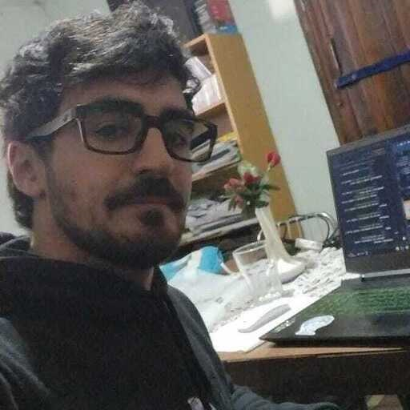
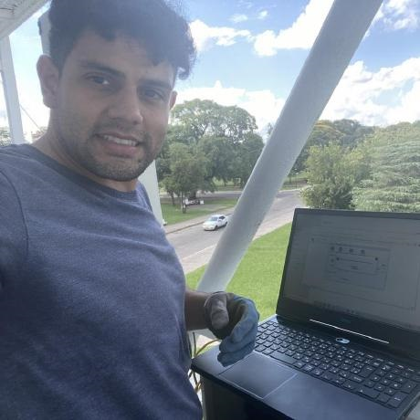

# Rolling Hotel & Resort
### Proyecto Final Grupo 3
#### Comisión 76i

Este repositorio contiene el código fuente del backend del sitio web de Rolling Hotel & Resort, un hotel ubicado en Bariloche, Argentina. El backend está diseñado para gestionar reservas de habitaciones, información sobre instalaciones y servicios, actividades locales y opciones gastronómicas, así como la gestión de usuarios y habitaciones.

### Tecnologías utilizadas

 |  | 

## Dependencias

- [bcrypt](https://www.npmjs.com/package/bcrypt): ^5.1.1
- [cors](https://www.npmjs.com/package/cors): ^2.8.5
- [dotenv](https://www.npmjs.com/package/dotenv): ^16.4.5
- [express](https://www.npmjs.com/package/express): ^4.19.2
- [express-validator](https://www.npmjs.com/package/express-validator): ^7.0.1
- [jsonwebtoken](https://www.npmjs.com/package/jsonwebtoken): ^9.0.2
- [mongoose](https://www.npmjs.com/package/mongoose): ^8.3.1
- [morgan](https://www.npmjs.com/package/morgan): ^1.10.0
- [nodemon](https://www.npmjs.com/package/nodemon): ^3.1.0

### Instalación
1. Clona este repositorio: `git clone https://github.com/TU_USUARIO/TU_REPOSITORIO.git`
2. Instala las dependencias: `npm install`
3. Inicia el servidor: `npm start`

### Contribuciones
¡Las contribuciones son bienvenidas! Si deseas contribuir a este proyecto, sigue estos pasos:
1. Haz un fork del repositorio
2. Crea una rama para tu contribución: `git checkout -b mi-contribucion`
3. Realiza tus cambios y haz commit: `git commit -am 'Añade mi contribución'`
4. Sube tus cambios a tu fork: `git push origin mi-contribucion`
5. Crea un nuevo Pull Request

### Equipo de Desarrollo
| Nombre                | Imagen                                       | GitHub                                       |
|-----------------------|----------------------------------------------|----------------------------------------------|
| Camila Alani          |   | [camilaalani](https://github.com/camilaalani) |
| Adrian Arnaldo Chanampa |   | [adrianarnaldo](https://github.com/AdrianKarma) |
| Cosme Nicolás Mas (Scrum Master)     |   | [cosmenicolas](https://github.com/CosmeNicolas) |
| Jose Ignacio Medina Jimenez |  | [joseignacio](https://github.com/Nachocode87) |
| Emir Paradi         |  | [emirparadi](https://github.com/penguinEm) |
